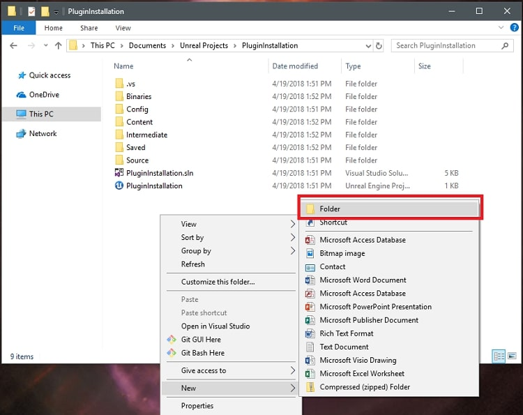

Unreal Capability Detect Demo
=============================

<p align="center">
  
</p>

> [!IMPORTANT]  
> This project will no longer be maintained by Intel. Intel has ceased development and contributions including, but not limited to, maintenance, bug fixes, new releases, or updates, to this project.
> *Intel no longer accepts patches to this project.
> 
> Therefore, development is currently maintained by [**@DryreL**](https://github.com/dryrel "**@DryreL**").
> 
> - It is only intended to make it compatible with new versions of Unreal Engine.
>
> - No new features will be added.

Description
=============================

This application demonstrates system capability detection using a third-party plugin in Unreal Engine.

<p align="center">
  
  
  
</p>

## Table of Contents
<!-- AUTO-GENERATED-CONTENT:START (TOC:collapse=true&collapseText="Click to expand") -->
<details>
<summary>"Click to expand"</summary>

- [Unreal Capability Detect Demo](#unreal-capability-detect-demo)
- [Description](#description)
- [Setup Instructions](#setup-instructions)
- [Requirements](#requirements)
- [Intel makes the most of computing power with new plugin](#intel-makes-the-most-of-computing-power-with-new-plugin)
    + [**Unreal Engine Capability Detect Plugin**](#unreal-engine-capability-detect-plugin)
    + [**Table 1.** CPU detect functions](#table-1-cpu-detect-functions)
    + [**Table 2.** Cache and memory detect functions](#table-2-cache-and-memory-detect-functions)
    + [**Table 3.** Render hardware interface (RHI) wrapper functions](#table-3-render-hardware-interface-rhi--wrapper-functions)
    + [**Table 4.** SynthBenchmark wrapper functions](#table-4-synthbenchmark-wrapper-functions)
    + [**SynthBenchmark**](#--synthbenchmark--)
  * [**Installing the Capability Detect Plugin**](#installing-the-capability-detect-plugin)
- [Unreal Engine 4.19 Feature Differentiation](#unreal-engine-419-feature-differentiation)
  * [**Detecting capabilities**](#detecting-capabilities)
  * [**Detecting capabilities in C++**](#detecting-capabilities-in-c)
  * [**Detecting capabilities in Blueprints**](#detecting-capabilities-in-blueprints)
  * [**Conclusion**](#conclusion)
  * [**EDITOR'S NOTE**](#editors-note)

</details>
<!-- AUTO-GENERATED-CONTENT:END -->

Setup Instructions
==================

> [!TIP]
> **Compiling the Third Party Library**
> * *Open CapabilityDetectDemo\Plugins\CapabilityDetect\Source\ThirdParty\CapabilityDetectLibrary\CapabilityDetectLibrary.sln*
> * Compile CapabilityDetectLibrary.sln as R*elease-x64*
> * Close CapabilityDetectLibrary.sln
> 
> **Generate Project Files**
> * Right click *CapabilityDetectDemo\CapabilityDetectDemo.uproject*
> * Select Generate Visual Studio project files
> 
> **Build Project**
> * Open *CapabilityDetectDemo\CapabilityDetectDemo.sln*
> * Build as *Development_editor-x64*
> * CTRL+F5 to launch unreal editor
> 
> **Verify Plugin**
> * Click *Edit->Plugins* from the main menu
> * Under the installed node find the *Intel(c)* node
> * Confirm the Capability Detect plugin is *visible* and *enabled*
> * Close the Plugin dialog
>
> **Start the Demo**
> * Run the project by clicking the *Play* button in the toolbar.
> * System Information should display on the screen.

> [!WARNING] 
> Make sure to add following code in your project's *.uproject* file, under **Modules** (edit on text editor).
> 
> "AdditionalDependencies": [
> 				"Engine",
> 				"CapabilityDetect"
> 			]

**Example:**
```
{
	"FileVersion": 3,
	"EngineAssociation": "4.27",
	"Category": "",
	"Description": "",
	"Modules": [
		{
			"Name": "CapabilityDetectDemo",
			"Type": "Runtime",
			"LoadingPhase": "Default",
			"AdditionalDependencies": [
				"Engine",
				"CapabilityDetect"
			]
		}
	],
	"Plugins": [
		{
			"Name": "CapabilityDetect",
			"Enabled": true
		}
	]
}
```

Requirements
==================

For compilation:

> [!IMPORTANT]  
> 1) Visual Studio C++ 2022 / JetBrains Rider 2022 or greater.
> 1) Unreal Engine 4.18 or greater.

Intel makes the most of computing power with new plugin
==================

With the release of Unreal Engine, many features have been optimized for multicore processors. In the past, game engines traditionally followed console design points, in terms of graphics features and performance. In general, most games weren't optimized for the processor, which can leave a lot of PC performance sitting idle. Intel's work with Unreal Engine is focused on unlocking the potential of games as soon as developers work in the engine, to fully take advantage of all the extra processor computing power that a PC platform provides.

**Intel's enabling work for Unreal Engine delivered the following:**
* Increased the number of worker threads to match a user's processor
* Increased the throughput of the cloth physics system
* Integrated support for Intel® VTune™ Amplifier

To take advantage of the additional computing power on high-end CPUs, Intel has developed a plugin that gives detailed CPU metrics and SynthBenchmark performance indicators. The metrics from this plugin can be used to differentiate features and content by CPU capability. Binning features and content in this manner will allow your game to run on a range of systems without impacting the overall performance.

### **Unreal Engine Capability Detect Plugin**
Using the Capability Detect Plugin, you can access C++ and Blueprint-compatible helper functions for CPU metrics, render hardware interface (RHI) functions, and the SynthBenchmark performance indexes for the CPU/GPU.

### **Table 1.** CPU detect functions
| Third Party Function  | Blueprint Function  | Description |
| :------------ |:---------------:| :------------------------------: |
| Intel_IsIntelCPU()      | IsIntelCPU() | Returns TRUE if Intel CPU |
| Intel_GetNumLogicalCores()      | GetNumLogicalCores()        |   Returns TRUE if Intel CPU |
| Intel_GetNumPhysicalCores() | GetNumPhysicalCores()        |    Returns Number of Logical Cores |
| Intel_GetCoreFrequency() | GetCoreFrequency()        |    Returns the current Core Frequency |
| Intel_GetMaxBaseFrequency() | GetMaxBaseFrequency()        |    Returns the Maximum Core Frequency |
| Intel_GetCorePercMaxFrequency()	 | GetCorePercMaxFrequency()        |    Returns % of Maximum Core Frequency in use |
| Intel_GetFullProcessorName() | GetFullProcessorName()        |    Returns Long Processor Name |
| Intel_GetProcessorName() | GetProcessorName()        |    Returns Short Processor Name |
| Intel_GetSKU() | N/A        |    Not in Use |

### **Table 2.** Cache and memory detect functions
| Third Party Function  | Blueprint Function  | Description |
| :------------ |:---------------:| :------------------------------: |
| Intel_GetUsablePhysMemoryGB()      | GetUsablePhysMemoryGB() | Returns Usable Physical Memory in GB |
| Intel_GetComittedMemoryMB()      | GetComittedMemoryMB()        |   Returns Committed Memory in MB |
| Intel_GetAvailableMemoryMB() | GetAvailableMemoryMB()        |    Returns Number of Logical Cores |
| Intel_GetCoreFrequency() | GetCoreFrequency()        |    Returns Available Memory in MB |

### **Table 3.** Render hardware interface (RHI) wrapper functions
| Third Party Function  | Blueprint Function  | Description |
| :------------ |:---------------:| :------------------------------: |
| NA      | IsRHIIntel() | Returns TRUE if GPU is Intel |
| NA      | IsRHINVIDIA()        |   Returns TRUE if GPU is NVIDIA |
| NA | IsRHIAMD()        |    Returns TRUE if GPU is AMD |
| NA | RHIVendorName()        |    Returns Vendor Name of GPU |

### **Table 4.** SynthBenchmark wrapper functions  
| Third Party Function  | Blueprint Function  | Description |
| :------------ |:---------------:| :------------------------------: |
| NA      | ComputeCPUPerfIndex()	 | 100: avg. good CPU, <100:slower, >100:faster |
| NA      | ComputeGPUPerfIndex()        |   100: avg. good GPU, <100:slower, >100:faster |

### **SynthBenchmark**

When using the SythBenchmark wrappers, be aware that the first call of each **ComputeCPUPerfIndex()** and **ComputeGPUPerfIndex()** will incur a slight performance cost while the performance indexes are computed. Performance index values are cached after the first call and subsequent calls to either **ComputeCPUPerfIndex()** or **ComputeGPUPerfIndex()** will not have the additional overhead of running the benchmark. For performance-critical aspects of your game, it is recommended to call both of these functions during startup or loading screens.

### **Installing the Capability Detect Plugin**

1. Download the Capability Detect Plugin from [**Releases**](https://github.com/DryreL/UnrealCapabilityDetectExtended/releases "**Releases**"). and open the project folder.

<p align="center">
  
</p>

2. If the Plugins folder doesn't exist in the root directory, *add it now*.

<p align="center">
  
  
</p>

3. Extract the CapabilityDetect plugin into the *Plugins* folder.

<p align="center">
  
</p>

4. Launch the project using the *.uproject* file.

<p align="center">
  
</p>

5. Go to **Edit > Plugins** in the main menu. When the Plugin window loads, the *Capability Detect Plugin* should be installed in the project.

<p align="center">
  
</p>

Now that the plugin is installed, it can be used to differentiate game content and features. In the next section, we'll describe how to use this plugin to bin features by CPU capabilities.

Unreal Engine 4.19 Feature Differentiation
==================

### **Detecting capabilities**

In order to segment features by platform configuration, create a new **UDataAsset** named **UPlatformConfig**. **UPlatformConfig** will store the characteristics of the platform being targeted such as the number of physical cores, logical cores, usable physical memory, processor name, and/or SynthBenchmark performance index.

```
#include "CoreMinimal.h"
#include "Engine/DataAsset.h"
#include "PlatformConfig.generated.h"
/**
* Platform Configuration Data Asset
*/
UCLASS(BlueprintType)
class CAPABILITYDETECTDEMO_API UPlatformConfig : public UDataAsset
{
      GENERATED_BODY()
public:
      UPROPERTY(EditAnywhere, BlueprintReadWrite, Category = "Platform Configuration")
      float CPUPerfIndex;
      UPROPERTY(EditAnywhere, BlueprintReadWrite, Category = "Platform Configuration")
      FString Name;
      UPROPERTY(EditAnywhere, BlueprintReadWrite, Category = "Platform Configuration")
      bool IsIntelCPU;
      UPROPERTY(EditAnywhere, BlueprintReadWrite, Category = "Platform Configuration")
      int NumPhysicalCores;
      UPROPERTY(EditAnywhere, BlueprintReadWrite, Category = "Platform Configuration")
      int NumLogicalCores;
      UPROPERTY(EditAnywhere, BlueprintReadWrite, Category = "Platform Configuration")
      float UsablePhysMemoryGB;
      UPROPERTY(EditAnywhere, BlueprintReadWrite, Category = "Platform Configuration")
      float ComittedMemoryMB;
      UPROPERTY(EditAnywhere, BlueprintReadWrite, Category = "Platform Configuration")
      float AvailableMemoryMB;
      UPROPERTY(EditAnywhere, BlueprintReadWrite, Category = "Platform Configuration")
      float CacheSizeMB;
      UPROPERTY(EditAnywhere, BlueprintReadWrite, Category = "Platform Configuration")
      float MaxBaseFrequency;
      UPROPERTY(EditAnywhere, BlueprintReadWrite, Category = "Platform Configuration")
      float CoreFrequency;
      UPROPERTY(EditAnywhere, BlueprintReadWrite, Category = "Platform Configuration")
      float CorePercMaxFrequency;
      UPROPERTY(EditAnywhere, BlueprintReadWrite, Category = "Platform Configuration")
      FString FullProcessorName;
      UPROPERTY(EditAnywhere, BlueprintReadWrite, Category = "Platform Configuration")
      FString ProcessorName;
};
```

Next, we can set up a class called **UPlatformTest** with static functions to compare **UPlatformConfig** properties to the capabilities detected by the plugin.

```
#include "CoreMinimal.h"
#include "PlatformTest.generated.h"
class UPlatformConfig;
/**
* Static functions for testing capabilities.
*/
UCLASS(BlueprintType)
class CAPABILITYDETECTDEMO_API UCapabilityTest : public UObject
{
      GENERATED_BODY()
public:
      UFUNCTION(BlueprintCallable, Category = "Capabilities")
      static bool CapabilityTest(UPlatformConfig* config);
      UFUNCTION(BlueprintCallable, Category = "Capabilities")
      static UPlatformConfig* GetCapabilityLevel();
};
```

The **CapabilityTest()** function will compare a **UPlatformConfig** to features detected by the Capability Detect Plugin. In this case, we will check if physical cores, logical cores, and the SynthBenchmark CPU performance index exceed the properties of the **UPlatformConfig** passed into the function.

```
#include "CoreMinimal.h"
#include "PlatformTest.generated.h"
class UPlatformConfig;
/**
* Static functions for testing capabilities.
*/
UCLASS(BlueprintType)
class CAPABILITYDETECTDEMO_API UCapabilityTest : public UObject
{
      GENERATED_BODY()
public:
      UFUNCTION(BlueprintCallable, Category = "Capabilities")
      static bool CapabilityTest(UPlatformConfig* config);
      UFUNCTION(BlueprintCallable, Category = "Capabilities")
      static UPlatformConfig* GetCapabilityLevel();
};
```

Now that we have a way to compare capabilities we can create another function to setup and test platform configurations. We'll create a function called **GetCapabilityLevel()** and create four segmentation levels named *LOW, MEDIUM, HIGH,* and *ULTRA*. We'll provide a name that corresponds to the feature level and specify the physical/logical cores, and SynthBenchmark performance index for each configuration being tested. Finally, since we are using a greater-than-or-equal symbol for the comparison in **CapabilityTest()**, we will test from highest to lowest and return the result.

```
UPlatformConfig* UCapabilityTest::GetCapabilityLevel()
{
      // Create Platform Definitions
      UPlatformConfig *ULTRA, *HIGH, *MEDIUM, *LOW;
      ULTRA = NewObject();
      HIGH = NewObject();
      MEDIUM = NewObject();
      LOW = NewObject();
      // Assign Properties to platform definitions.
      // LOW - 2 Physical Cores 4 Hyper-threads
      LOW->Name = TEXT("LOW");
      LOW->NumPhysicalCores = 2;
      LOW->NumLogicalCores = 4;
      LOW->CPUPerfIndex = 0.0;
      // MEDIUM - 4 Physical Cores 8 Hyper-threads
      MEDIUM->Name = TEXT("MEDIUM");
      MEDIUM->NumPhysicalCores = 4;
      MEDIUM->NumLogicalCores = 8;
      MEDIUM->CPUPerfIndex = 50.0;
      // HIGH - 6 Physical Cores 12 Hyper-threads
      HIGH->Name = TEXT("HIGH");
      HIGH->NumPhysicalCores = 6;
      HIGH->NumLogicalCores = 12;
      HIGH->CPUPerfIndex = 100.0;
      // ULTRA - 8 Physical Cores 16 Hyper-threads
      ULTRA->Name = TEXT("ULTRA");
      ULTRA->NumLogicalCores = 8;
      ULTRA->NumPhysicalCores = 16;
      ULTRA->CPUPerfIndex = 125.0;
      // Test platforms against detected capabilities.
      if (CapabilityTest(ULTRA)) {
             return ULTRA;
      }
      if (CapabilityTest(HIGH)) {
             return HIGH;
      }
      if (CapabilityTest(MEDIUM)) {
             return MEDIUM;
      }
      return LOW;
}
```

### **Detecting capabilities in C++**

With the **UCapabilityTest** class we now have a way to determine CPU feature levels. We can use the results from **GetCapabilityLevel()** to differentiate content in either C++ or Blueprints. For instance, if we create an actor, we can differentiate features in the Tick function.

<p align="center">
  
</p>

```
// Called every frame
void AMyActor::Tick(float DeltaTime)
{
      Super::Tick(DeltaTime);
      UPlatformConfig* CapabilityLevel = UCapabilityTest::GetCapabilityLevel();
      if (CapabilityLevel->Name == TEXT("LOW"))
      {
             // Use Simple Approximation for LOW end CPU...
             // e.g. Spawn 100 CPU Particles...
      }
      else if (CapabilityLevel->Name == TEXT("MEDIUM"))
      {
             // Use Advanced Approximation for MID range CPU...
             // e.g. Spawn 200 CPU Particles
      }
      else if (CapabilityLevel->Name == TEXT("HIGH"))
      {
             // Use Simple Simulation for HIGH end CPU...
             // e.g. Spawn 300 CPU Particles
      }
     else if (CapabilityLevel->Name == TEXT("ULTRA"))
      {
             // Use Advanced Approximation for ULTRA CPU...
             // e.g. Spawn 400 CPU Particles
      }
}
```

### **Detecting capabilities in Blueprints**

Alternatively, we can use the same **GetCapabilityLevel()** function we used in our actor's Tick function in Blueprints, since we decorated it with the UFUNCTION(BlueprintCallable) attribute. In this case, we are using the level Blueprint and call the Get Capability Level node after the **BeginPlay**. The **UPlatformConfig** value returned by the **Get Capability Level** node has a **Name** property that can be used in a **Switch on String** node to differentiate features in your level. Finally, we just print the name of the CPU feature level to the screen (Figure 1).

<p align="center">
  
</p>

Lastly, there is a Blueprint function that comes packaged with the Capability Detect Plugin. With this function you can get more granularity with your platform details in your Blueprints. Just add the **Detect Capabilities** node to your Blueprint and utilize the values you need for your game (Figure 2). 

<p align="center">
  
</p>

### **Conclusion**
With the higher core counts of modern CPUs, we can do much more with our games. However, players with fewer cores may be at a disadvantage compared to players with higher-end systems. To alleviate this disparity, it is possible to bin features using both C++ and Blueprints. Binning features as demonstrated will allow for maximum CPU usage while maintaining a consistent framerate for players with a range of platform configurations.
 
### **EDITOR'S NOTE**
Get tools and resources for optimizing Unreal Engine experiences on Intel(R) architecture designed to provide optimization strategies and business opportunities that developers and software businesses need to innovate and succeed.

To be notified of other content for game devs and get a host of other perks, join the [Intel Game Dev Program](https://www.intel.com/content/www/us/en/developer/topic-technology/gamedev/overview.html "Intel Game Dev Program").

> [!NOTE]  
> This content originally appeared at the [Intel Developer Zone](https://software.intel.com/en-us/articles/cpu-capability-detect-using-unreal-engine-4-19 "Intel Developer Zone").
> 
> Also posted on [Unreal Engine Blog](https://www.unrealengine.com/en-US/blog/intel-makes-the-most-of-computing-power-with-new-plugin "Unreal Engine Blog").